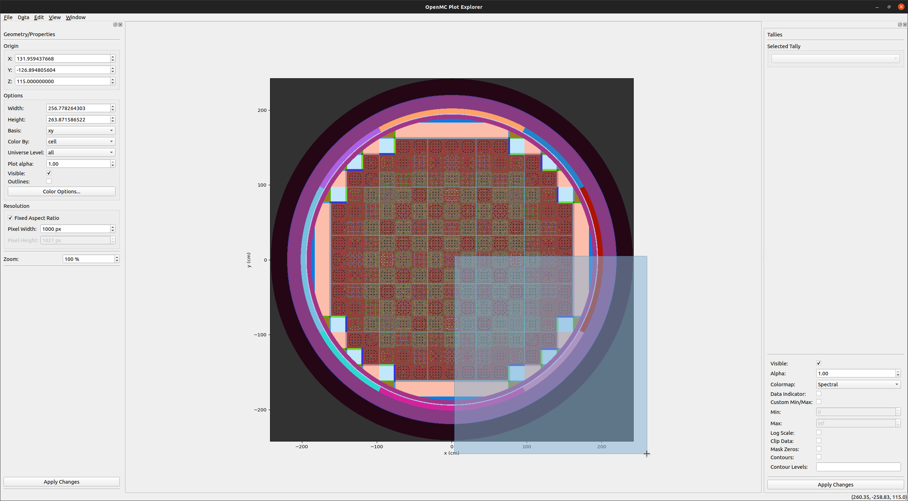
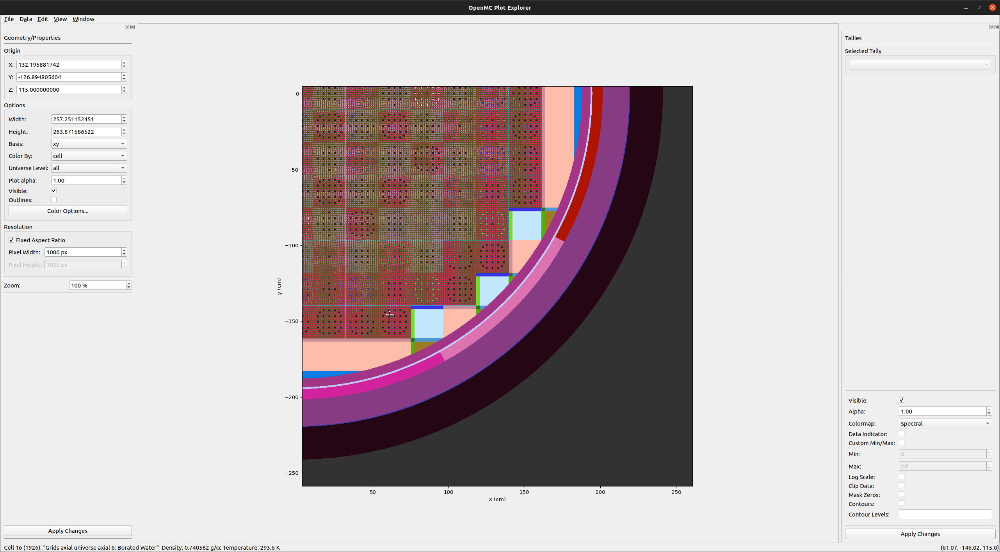
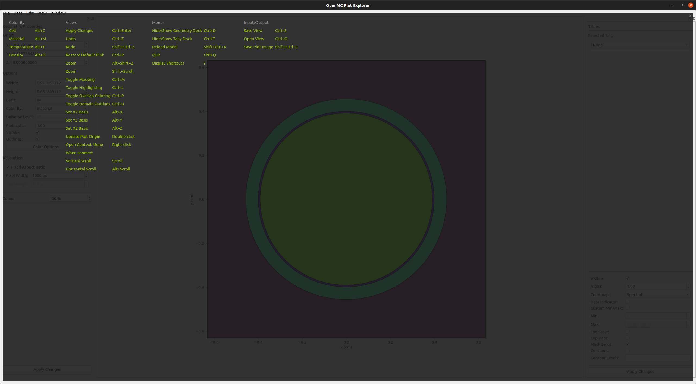
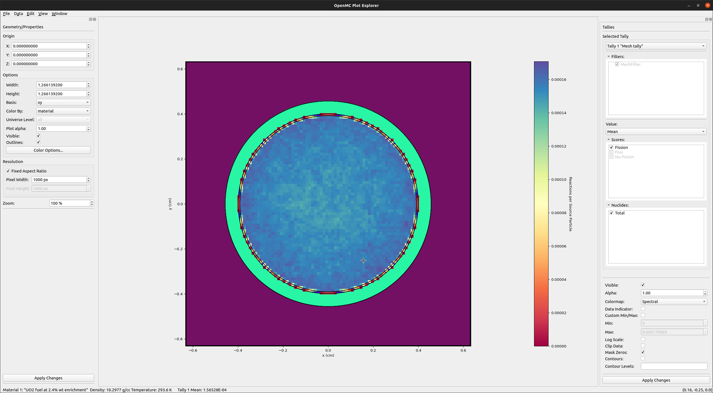
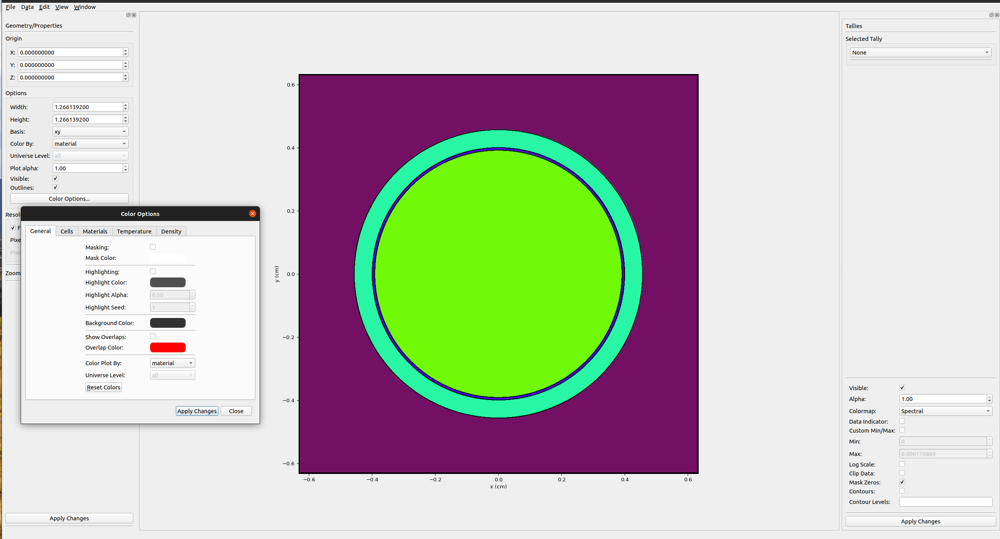
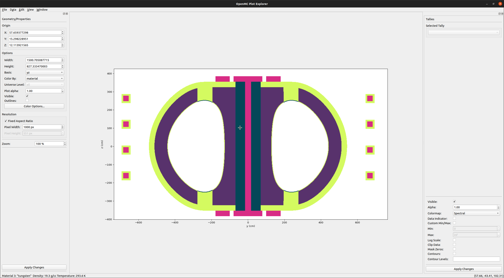
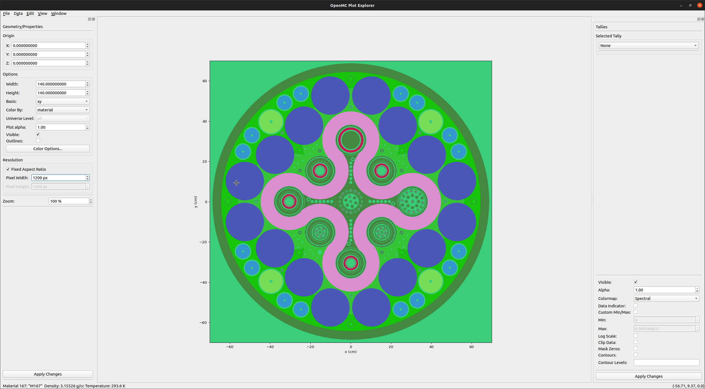

[](https://pypi.org/project/openmc-plotter/)

# OpenMC Plot Explorer

## Description

A graphical interface for visualizing and navigating OpenMC models.

Originally created by @landonjmitchell at the University of Chicago ([original
repository](https://github.com/landonjmitchell/openmc-plotgui)).





## Dependencies

OpenMC, Matplotlib, NumPy, PySide2

## Installation

This package is most easily installed by running

```console
pip install openmc-plotter
```

## Usage

From a directory containing an OpenMC model run:

```console
openmc-plotter
```

Once the viewer has opened, press `?` to view a variety of keyboard shortcuts.



## Features

### Tally Visualization

The plotter also provides the ability to view tallies with spatial filters (mesh
filter, cell filter, etc.). After loading a statepoint file from the "Edit"
menu, tallies can be displayed on top of the geometry.



Filters, scores, and nuclides on the tally can be enabled/disabled to isolate data.

### Color Manipulation

Cell and material colors can be customized in the color dialog menu. Overlap
coloring can be enabled as well to debug problems in the geometry definition.



### DAGMC Geometry Visualization

The plotter can also present the CAD-based tesellation geometry enabled by the
[Direct Accelerated Geometry Monte Carlo](https://svalinn.github.io/DAGMC/)
(DAGMC) toolkit. Below is the cross section of a tokamake model generated using [paramak](https://paramak.readthedocs.io/en/main/):



As well as a DAGMC model of the Advanced Test Reactor (ATR):



### Saving and Exporting

  - Any image displayed in the plotter can be saved in any format supported by the
user's Matplotlib installation.

  - Tally and geometry data (material/cell IDs) can be exported to a VTK file under "File->Export"

# Options/Functionality

## Menu Bar:

  - File&rightarrow;Save Image As... : Save an image file of the current plot.
  - File&rightarrow;Save View Settings... : Save a .pltvw pickle file containing the current plot settings.
  - File&rightarrow;Open View Settings... : Open and load a .pltvw pickle file containing a previously saved view.
  - File&rightarrow;Quit : Quit the application.

  - Edit&rightarrow;Apply Changes : Apply any un-applied plot setting changes, and reload plot image.
  - Edit&rightarrow;Undo : Undo last applied plot settings changes, and reload plot image.
  - Edit&rightarrow;Redo : Redo last applied plot settings changes, and reload plot image.
  - Edit&rightarrow;Restore Default Settings : Restore to default plot settings and reload plot image.

  - Edit&rightarrow;Basis&rightarrow;xy : Change plot basis to xy, apply changes, and reload plot.
  - Edit&rightarrow;Basis&rightarrow;xz : Change plot basis to xz, apply changes, and reload plot.
  - Edit&rightarrow;Basis&rightarrow;yz : Change plot basis to yz, apply changes, and reload plot.
  - Edit&rightarrow;Color By&rightarrow;Cell : Change plot settings to be colored by cell, apply changes, and reload plot.
  - Edit&rightarrow;Color By&rightarrow;Material : Change plot settings to be colored by material, apply changes, and reload plot.
  - Edit&rightarrow;Enable Masking : Enable/Disable masking, apply changes, and reload plot.
  - Edit&rightarrow;Enable Highlighting : Enable/Disable highlighting, apply changes, and reload plot.
  - Edit&rightarrow;Enable Overlap Coloring : Enable/Disable display of geometry overlaps, apply changes, and reload plot.

  - View&rightarrow;Hide[Show] Dock : Hide/Show Dock.
  - View&rightarrow;Zoom... : Open dialog to input new zoom value.

  - Window&rightarrow;Main Window : Activate, bring main window to front.
  - Window&rightarrow;Color Options : [Open], activate, bring color options dialog to front.

## Dock:

### Origin:
  - X, Y, Z : Set the active plot origin to the values entered for each dimension.

### Options:

  - Width : Set the width of the active plot in plot units.
  - Height : Set the height of the active plot in plot units.
  - Basis : Set the basis of the active plot.
  - Color By : Select how the active plot is colored.
  - Color Options... : Open the color options dialog.

### Resolution:

  - Fixed Aspect Ratio : Check to prevent plot image stretching/warping.
  - Pixel Width: Set width in pixels of active plot.
  - Pixel Height : Set height in pixels of active plot.

### Other:

  - Apply Changes : Apply changes made to active plot, reload plot image.
  - Zoom : Set zoom level of plot image.

## Plot Image

### Actions:

  - Mouse Hover : Display plot coordinates in bottom-right of status bar.  Display cell/material ID and name (if any) in bottom-left of status bar.

  - Left Mouse Button Drag : Crop active plot to selection, apply changes, and reload plot image.
  - <kbd>Shift</kbd> + Left Mouse Button Drag : De-crop active plot so that the current plot dimensions fit within selected area, apply changes, and reload plot image.
  - Note: To cancel selection, reduce selection size to less than 10 pixels in
    either dimension and release. Active plot Origin, width, and height values
    will be returned to current plot settings.

  - Double-Click Left Mouse Button : Set origin to point clicked, apply changes, and reload plot image.
  - <kbd>Shift</kbd> + Scroll : Increase/Decrease zoom level of plot image.

  - Right-Click on plot background &rightarrow; activate context menu:
      - Edit Background Color... : Select a new color for plot background, apply changes, and reload plot image.

    See menu bar for other context menu options.
  - Right-Click on plot overlap region &rightarrow; activate context menu:
      - Edit Overlap Color... :  Select a new color for overlap regions, apply changes, and reload plot image.

  - Right-click on plot cell/material : Activate context menu:
    - Displays cell/material ID and name (if defined).
    - Edit Cell/Material Color... : Select a new color for the selected cell/material, apply changes, and reload plot image.
    - Mask Cell/Material : Mask/Unmask selected cell/material, apply changes, and reload plot image.
    - Highlight Cell/Material : Highlight/Unhighlight selected cell/material, apply changes, and reload plot image.


    See menu bar for other context menu options.

## Color Options Dialog

### General Tab:

  - Masking : Enable/Disable masking on active plot.
  - Mask Color : Select color of masked components on active plot.
  - Highlighting : Enable/Disable highlighting on active plot. Enabling
    highlighting will disable custom cell/material color selection.
  - Highlight Color : Select overlay color of non-highlighted cells/materials.
  - Highlight Alpha : Set alpha transparency level of non-highlighted color overlay.
  - Highlight Seed : Select seed for randomized colorization of cells/materials when highlighting is enabled.
  - Background Color : Select color of plot background for active plot.
  - Show Overlaps : Display overlap regions on the plot.
  - Overlap Color : Customize the displayed color of overlap regions.
  - Color Plot By : Select how the active plot is to be colored.

### Cells/Materials Tabs:

  - Double-click Name field to edit cell/material name. Edited names will not be reflected in .xml files.
  - Double-click Color field to select a color for the cell/material in the active plot.
  - Double-click SVG/RBG field to enter a new color for the cell/material. May
    be entered as SVG color, or RGB value (with or without parentheses).
  - Right-click Color or SVG/RGB field to clear. This will reset the color to the default value.
  - Click Mask field to mask/unmask cell/material in active plot.
  - Click Highlight field to highlight/unhighlight cell/material in active plot.
  - Apply Changes : Apply changes made to active plot, reload plot image.
  - Close : Close the color options dialog.

  **Note: Fields appear dynamically based on whether Masking/Highlighting are enabled or disabled.**

### On Open:

  Application windows are restored to their previous locations and sizes.  If
  the .xml files match those of the previous sessions, the plot model will be
  restored to its previous state.

### On Close:
  Application status, including window size and location, will be saved.  The
  current state of the plot model, including current plot and up to 10
  previous/subsequent plots (i.e. for undo/redo) will be saved.  Active plot
  changes that have not been applied will be lost.

## Developer Notes

### Structure

  - openmc-plotter: primary executable. contains the major program logic used to interact with the application.
  - plotmodel.py: contains the underlying data structure of the plot model and application state.
  - plotgui.py: contains the bulk of the graphical elements of the application.
  - overlays.py: contains screen overlays seen in the GUI. Just keyboard shortcuts for now.
  - plot_colors.py: module with convenience functions for generating and modifying RGB/RGBA colors
  - assets: directory containing icons and images for the application

### Terminology

#### Plot Image
  The plot slice image in the central area of the application.

#### Active Plot
  Plot settings that are changed as dock and color dialog fields are changed.  Not necessarily reflected in the plot image.

#### Current Plot
  Plot settings currently displayed in the plot image.

Applying changes causes the active plot to become the current plot, and a new plot image to be generated.
